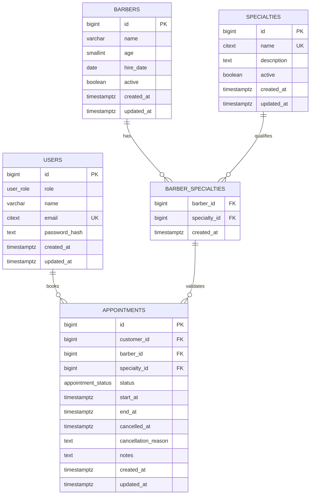

# DER - NicattoBeard

## Observacoes de modelagem

- `users` concentra autenticacao e autorizacao por meio do campo `role` (`customer` | `admin`).
- `barbers` permanece separado porque o teste exige atributos especificos do profissional e nao exige login para barbeiros.
- `barber_specialties` garante a relacao N:N entre profissionais e servicos.
- `appointments` referencia a dupla `(barber_id, specialty_id)` via FK composta apontando para `barber_specialties`. Isso impede agendar um barbeiro em uma especialidade que ele nao atende.
- O status do agendamento e um enum com dois valores: `scheduled` e `cancelled`.

## Constraints e indices relevantes

| Tipo | Nome / Descricao | Detalhe |
|------|-------------------|---------|
| CHECK | `age BETWEEN 18 AND 100` | Valida idade do barbeiro. |
| CHECK | `hire_date <= CURRENT_DATE` | Impede data de contratacao futura. |
| CHECK | `end_at = start_at + 30 min` | Garante duracao fixa do slot. |
| CHECK | Consistencia de cancelamento | `cancelled_at` obrigatorio se `status = 'cancelled'`, nulo caso contrario. |
| UNIQUE PARTIAL | `uq_appointments_barber_active_slot` | `(barber_id, start_at) WHERE status = 'scheduled'` — impede conflito de horario. |
| INDEX | `idx_appointments_customer_start_at` | `(customer_id, start_at DESC)` — consulta de agendamentos do cliente. |
| INDEX | `idx_appointments_start_at_status` | `(start_at, status)` — consulta administrativa por dia/futuros. |
| INDEX | `idx_barbers_active` / `idx_specialties_active` | Filtro rapido por registros ativos. |
